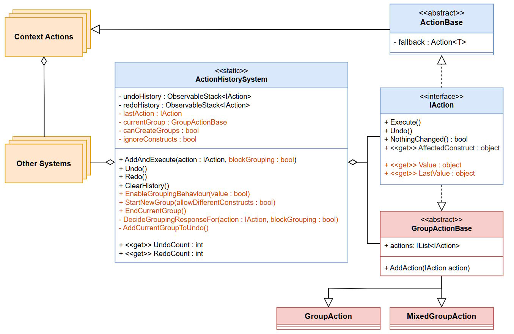

This is a free undo/redo system for Unity that:

- Uses a 2-stack system with the Command pattern to add undo/redo to your game/editor.
- Supports adding custom actions and allows action grouping.
- Has built-in actions for **dropdowns, input fields, toggles and sliders**
- Comes with an example that also adds support for **drawing grids**, used in editors

Tested in Unity 6000.1.2f1.

# Structure & Requirements
The package is split into 3 assembly definitions:

### **RedRats.Core**
- Contains general scripts, used by the other two assemblies.
- Requires **TextMeshPro** as a reference.

### **RedRats.UndoRedoSystem**
  - Contains the core undo/redo system, known as _ActionHistory_.
  - Requires **TextMeshPro** and **RedRats.Core** as a reference.

### **RedRats.UndoRedoSystem.Examples**
- Contains the example scene with a drawing grid and it's custom actions.
- Requires **Unity.InputSystem**, **RedRats.Core** and **RedRats.UndoRedoSystem** as a reference.

# Quick Start

1. Import the package into your project.
2. All interactions with the system go through the `ActionHistorySystem` static class via it's `AddAndExecute()`, `Undo()` & `Redo() `methods.

# Using Action Grouping
1. If you _don't want_ to use action grouping (required for sliders and drawing grid to work), disable the behaviour with the following line
`ActionHistorySystem.EnableGroupingBehaviour(false)`

    You can also just change the default value of canCreateGroups in ActionHistorySystem.
2. If you _want_ to use action grouping, you can control it manually with `StartNewGroup()` and `EndCurrentGroup()` methods in AHS. By default groups are tied to a single construct, and once an action tied to a different construct appears, the group is automatically closed and a new one os created.

   (_for example if 3 actions affecting a single dropdown come to AHS, they are grouped. If the next action affects a toggle or a different dropdown, the current group is closed and the current action starts a new one._)
3. To enable something akin to an _automated grouping system_, you can hook the StartNewGroup() and EndCurrentGroup() methods to pressing/releasing the left mouse button. The example does this in it's InputSystem class via the _ClearAllInput()_ method.

# Adding custom actions
If you want to add support for your custom ui elements or different actions, follow:
1. Create a new class and make it inherit from `ActionBase<T>`, where T represents a value that is changed in the action.

   (If your action doesn't have a backing data field and affects only values stored on the construct then inherit from `IAction`. If you do that however, know that the action cannot be undone unless it's construct exists.)

2. Implement all fields and methods. Look at built-in actions for examples.

3. Now when you want to change a value of construct, instead of setting it directly, call `AddAndExecute()` from AHS method and put in your action.

For details look at the built-in examples. (For Dropdown you want to see classes `UpdateDropdownAction` - action and `IPDropdown` - caller) 

# System Overview

- **ActionHistorySystem** - The main controller of the system. It handles the undo/redo stacks and action grouping.
- **IAction** - The base interface for all actions, normal and special opens like grouping actions.
- **ActionBase** - Adds the ability to affect only the data layer of the application, without changing the construct's UI. Is necessary to allow undoing actions whose construct is not active or is destroyed. User actions should prefer implementing this over IAction.
- **GroupActionBase** - A base for all grouping actions. Not necessary to be changed.
- **GroupAction** - A grouping action that allows grouping under the same constructed. Is used by default.
- **MixedGroupAction** - A grouping action that allows grouping under _different_ constructs. To use it, you must enable it when calling `StartNewGroup()` in AHS.

# Credits
Fonts used in the example:

- Perfect DOS VGA 437 by Zeh Fernando
- Bit Cell by memesbruh03