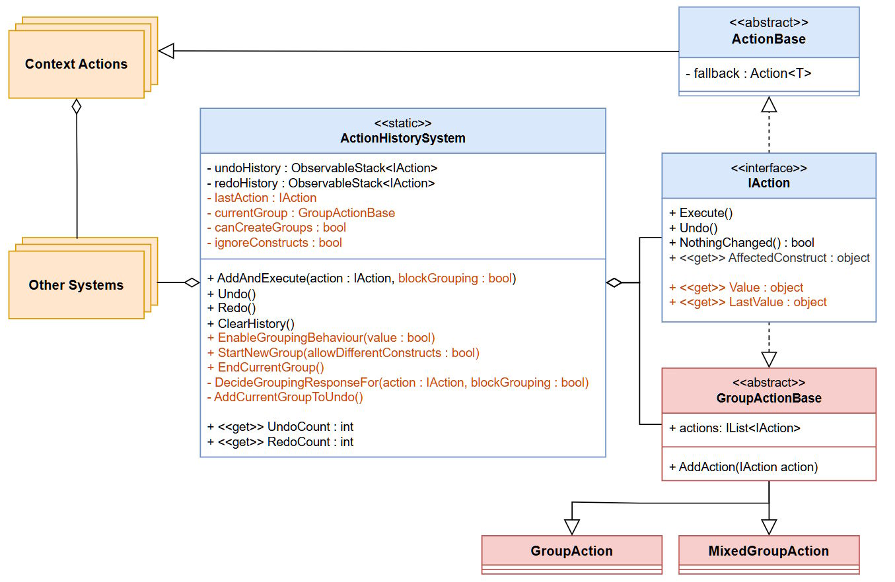

# Undo/Redo with Action Grouping
This is a free undo/redo system for Unity that:

- Uses a 2-stack system with the Command pattern to add undo/redo to your game/program.
- Supports adding custom actions and allows action grouping.
- Has built-in actions for **dropdowns, input fields, toggles and sliders**.
- Comes with an example that also adds support for **drawing grids**, usually used in drawing/level editors.

Tested in Unity 6000.1.2f1.

## Structure & Requirements
The package is split into 3 assembly definitions with predefined references. Make sure you have the required packages imported from the Package Manager.

### **RedRats.Core**
- Contains general scripts and is used by the other two assemblies.
- Requires **TextMeshPro** as a reference.

### **RedRats.UndoRedoSystem**
  - Contains the undo/redo system itself, known as _ActionHistory_.
  - Requires **TextMeshPro** and **RedRats.Core** as a reference.

### **RedRats.UndoRedoSystem.Examples**
- Contains the example scene with a drawing grid and it's custom actions.
- Requires **Unity.InputSystem**, **RedRats.Core** and **RedRats.UndoRedoSystem** as a reference.

## Project Setup

1. Import the package into your project.
2. All interactions with the system go through the static class called `ActionHistorySystem` via it's `AddAndExecute()`, `Undo()` & `Redo() `methods.

## Using Action Grouping
1. If you _don't want_ to use action grouping (required for sliders and drawing grid to work), disable the behaviour with the following method: `ActionHistorySystem.EnableGroupingBehaviour(false)`

    You can also just change the default value of canCreateGroups in ActionHistorySystem.
2. If you _want_ to use action grouping, you can control it manually with the `StartNewGroup()` and `EndCurrentGroup()` methods in AHS. By default, groups are tied to a single construct, and once an action tied to a different construct appears, the current group is automatically closed with a new one created immediately after.

   (_for example if 3 actions that affect a single dropdown come into AHS, they get grouped. If the next action that comes affects a toggle or a different dropdown, the current group is closed and a new one is started._)
3. To enable something akin to an _automated grouping system_, you can hook the StartNewGroup() and EndCurrentGroup() methods to pressing/releasing the left mouse button. The example does this in it's InputSystem class via the `ClearAllInput() `method.

## Adding custom actions
If you want to add support for your own custom actions, follow these steps:
1. Create a new class and make it inherit from `ActionBase<T>`, where T represents a value that is changed in the action.

   (If your action doesn't have a backing data field and affects only values stored on the construct then inherit from `IAction`. If you do that however, know that your action cannot be undone at runtime unless it's construct still exists.)

2. Implement all fields and methods. Look at built-in actions for examples.

3. Now in the method you want to change the value of your construct, instead of setting it directly, call `AddAndExecute()` from AHS and insert your action as a parameter.

For details look at the built-in examples. (For Dropdown you want to see classes `UpdateDropdownAction` - action and `IPDropdown` - caller) 

## System Overview

- **ActionHistorySystem** - The main controller of the system. It handles the undo/redo stacks and action grouping.
- **IAction** - The base interface for all normal and special actions (like grouping actions).
- **ActionBase** - Adds the ability to affect only the data layer of the application, without changing the construct's UI. Is necessary to allow undoing actions whose construct is not active or is destroyed. _User actions should prefer implementing this over IAction_.
- **GroupActionBase** - A base for all actions that group together other actions.
- **GroupAction** - A grouping action that allows grouping under the same constructed. Is used in AHS by default.
- **MixedGroupAction** - A grouping action that allows grouping under _different_ constructs. To use it, you must enable it when calling `StartNewGroup()` from AHS.

## Key Methods
- **ActionHistorySystem.AddAndExecute()** - Adds an action to the undo history and executes it.
- **ActionHistorySystem.Undo()** - Undoes the last action.
- **ActionHistorySystem.Redo()** - Redoes the last undone action.
- **ActionHistorySystem.StartNewGroup()** - Starts a new group of actions. Can be set to start a group that can contain actions with different constructs.
- **ActionHistorySystem.EndCurrentGroup()** - Ends the current group of actions.

## System in detail
To understand the inner workings of the system in more detail, you can look in the attached PDF. (Unfortunately, it is only in Czech/Čeština).

[master_thesis(CZ)](Documentation_and_implementation_of_functions_that_improve_the_usability_of_the_software_Jan_Kunetka.pdf)

## Credits
Fonts used in the example:

- Perfect DOS VGA 437 by Zeh Fernando
- Bit Cell by memesbruh03

## Other Projects
#### Shortcut Linking + Remapping
- Besides this system I have also created a Shortcut Linking + Remapping system that supports variable combinations.
- Available on GitHub: [RedRats.ShortcutSystem](https://github.com/WaluigiNumber8/unity-shortcuts-and-remapping-system)